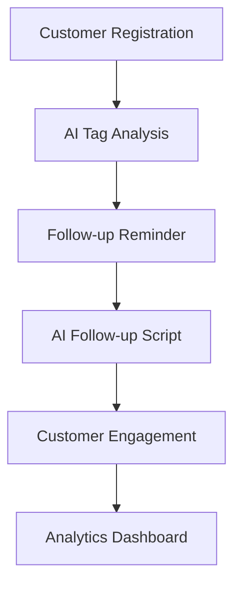

# AI Beauty CRM Business Positioning

## Product Positioning

AI Beauty CRM is an AI-powered customer management and private-domain operations system for:

- Beauty salons
- Medical beauty clinics
- Wellness stores
- Mother & baby businesses

The goal is to help stores improve:

- Customer retention
- Follow-up efficiency
- Repurchase rate
- Staff workflow management
- Customer lifecycle operations

---

## Core Features

### AI Customer Management

- Customer tags
- Lifecycle tracking
- Follow-up history
- Customer segmentation

### AI Follow-up Automation

- Auto reminders
- AI-generated scripts
- Silent-customer alerts
- Follow-up workflow automation

### AI Knowledge Base + RAG

- Product knowledge
- Internal training
- AI Q&A assistant
- Smart customer support

### Dashboard & Analytics

- Conversion analysis
- Customer insights
- Store operation analytics
- Private-domain data tracking

---

## Business Workflow

---

## GitHub Optimization Suggestions

1. Add dashboard screenshots
2. Add demo videos
3. Focus README on business value first
4. Put tech stack after business scenarios
5. Reduce technical jargon on homepage

---

## Recommended Branding

Suggested public branding:

# AI Beauty CRM

Subtitle:

AI Customer Management System For Beauty & Wellness Business
