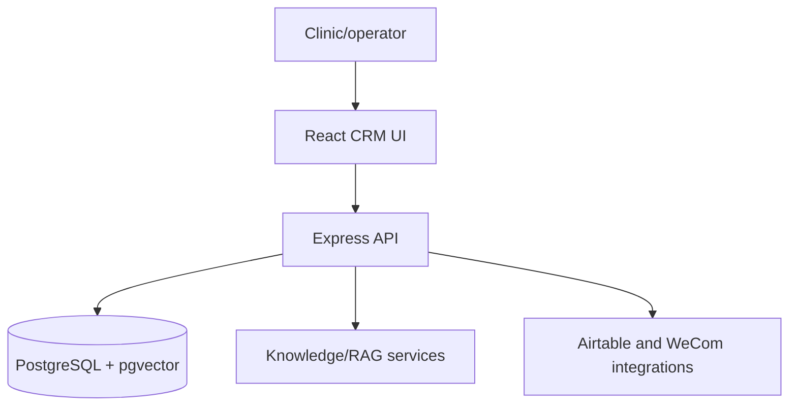

# Medical beauty CRM landing

Full-stack medical beauty CRM and landing-page system with customer lead management, knowledge-base/RAG features, Airtable integration hooks, and product-facing frontend screens.

## Architecture

- Detailed overview: [`docs/architecture.md`](docs/architecture.md)
- Mermaid source: [`docs/architecture.mmd`](docs/architecture.mmd)

## Tech stack

| Area | Technology |
| --- | --- |
| Frontend | React, TypeScript, Vite, Tailwind CSS |
| Backend | Node.js, Express, TypeScript |
| Data | PostgreSQL, pgvector, Drizzle |
| AI/product | Knowledge retrieval, customer-service assistant flows |
| Integrations | Airtable and enterprise messaging hooks |

## Repository hygiene

Real API keys, Airtable tokens, database contents, generated logs, and local `.env` files must stay outside Git. Use `.env.example` and deployment secret management for configuration.
