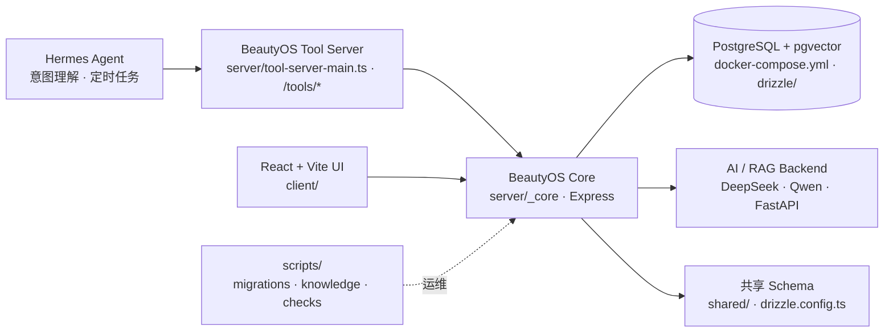

<div align="center">

# 💄 AI BeautyOS

**Agent-Native 美业经营系统 — 面向美业、医美、养生与母婴门店的 AI CRM 操作系统**
_An agent-native AI CRM operating system for beauty, medical beauty, wellness, and mother-baby businesses_

<p>


</p>

<p>


</p>

</div>

---

## 📖 简介 · About

AI BeautyOS 是一个**Agent-Native 美业经营系统**,聚焦客户跟进、私域运营、知识库问答、经营看板与门店工作流自动化。它面向 beauty salons、medical beauty clinics、wellness stores 与 mother & baby businesses,帮助门店减少人工跟进遗漏、沉淀客户资产并提升复购与转化。

仓库采用三层架构:Hermes Agent 负责意图理解和工具调度,BeautyOS Tool Server 提供稳定工具接口与审计边界,BeautyOS Core 承载 CRM、内容、知识库、企微与 Web 业务能力。

## ✨ 特性 · Features

- �� **客户生命周期管理** — 客户标签、分层、跟进历史与客户分群
- 🤖 **AI 跟进自动化** — 提醒工作流、话术生成、沉默客户预警与任务生成
- 📚 **知识库 + RAG** — 内部知识库、产品资料检索与员工 AI Q&A
- 📊 **经营分析看板** — 转化分析、客户洞察与运营报表
- 🧰 **Hermes 工具层** — `/tools/*` Tool Server 支持 Agent 调度、权限审计与 dry-run
- 🐳 **单机容器化部署** — `docker-compose.yml` 编排 Web、PostgreSQL/pgvector 与 Tool Server

## 🏗️ 架构 · Architecture



## 🚀 快速开始 · Quick Start

### 环境要求 · Prerequisites

- Node.js + pnpm
- Docker / Docker Compose
- PostgreSQL + pgvector（Compose 使用 `pgvector/pgvector:pg16`）
- Python 3（用于 `server/requirements.txt` 中的 FastAPI AI 后端能力）

### 安装 · Installation

```bash
# 1. 克隆并进入项目
git clone https://github.com/CHINGBOH/ai-beautyos.git
cd ai-beautyos

# 2. 安装 Node 依赖
pnpm install

# 3. 配置环境变量
cp .env.example .env   # 填写 DATABASE_URL、JWT_SECRET、DEEPSEEK_API_KEY

# 4. 本地开发
pnpm run dev

# 5. (可选) 容器化启动 Web + PostgreSQL + Tool Server
docker compose up -d --build
```

## 📂 目录结构 · Project Structure

```text
ai-beautyos/
├── .github/                 # GitHub 工作流与仓库配置
├── client/                  # React + TypeScript + Vite 前端
├── config/                  # 运行配置
├── data/                    # 业务与知识库数据资产
├── docs/                    # 部署、架构与运营文档
├── drizzle/                 # Drizzle / 数据库迁移资产
├── e2e/                     # 端到端测试
├── patches/                 # 依赖补丁
├── scripts/                 # 数据库、知识库、企微、检查脚本
├── server/                  # Express Core、Tool Server 与 Python AI 后端
├── shared/                  # 前后端共享类型与 schema
├── docker-compose.yml       # 单机生产 Compose
├── docker-compose.full.yml  # 完整部署 Compose
├── package.json             # pnpm 脚本与前端/后端依赖
├── drizzle.config.ts        # Drizzle 配置
└── vite.config.ts           # Vite 构建配置
```

## 🛠️ 技术栈 · Built With


## 📄 License

私有仓库 · Private repository. 版权归作者所有。

---

<div align="center"><sub>📐 README 遵循 <a href="https://github.com/othneildrew/Best-README-Template">Best-README-Template</a> 标准</sub></div>
