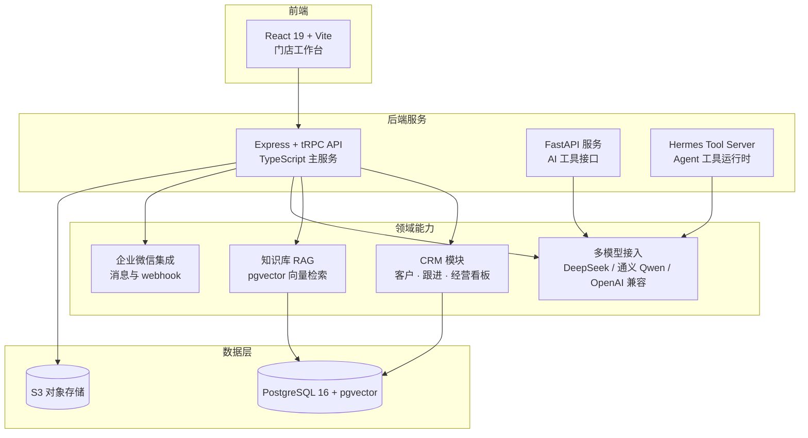

<div align="center">

<a name="top"></a>

# 💄 AI BeautyOS

**Agent-Native 美业经营系统 — 面向美业、医美、养生与母婴门店的 AI CRM 操作系统**  
*An agent-native AI CRM operating system for beauty, medical beauty, wellness, and mother-baby businesses*

<p>


</p>
<p>


</p>
<p>


</p>

</div>

---

## 📖 目录

- [🌟 项目简介](#-项目简介)
- [🏗 系统架构](#-系统架构)
- [⚡ 核心特性](#-核心特性)
- [🛠️ 技术栈](#️-技术栈)
- [🚀 快速开始](#-快速开始)
- [📁 项目结构](#-项目结构)
- [🧪 测试](#-测试)
- [🗺️ 路线图](#️-路线图)
- [📚 文档](#-文档)
- [⚠️ 合规提示](#️-合规提示)
- [📄 许可证](#-许可证)

---

## 🌟 项目简介

**AI BeautyOS** 是一个 **Agent-Native 美业经营系统**，聚焦客户跟进、私域运营、知识库问答、经营看板与门店工作流自动化。面向美容院、医美诊所、养生馆与母婴门店，帮助门店减少人工跟进遗漏、沉淀客户资产并提升复购与转化。

---

## 🏗 系统架构



---

## ⚡ 核心特性

| 特性 | 说明 |
|---|---|
| 👥 客户 CRM | 客户档案、跟进记录与经营看板（Recharts 可视化），覆盖门店日常运营闭环 |
| 📚 知识库 RAG | 基于 pgvector 的知识入库、向量检索与问答，支持文档导入与本地 Embedding |
| 🤖 多模型 AI 接入 | DeepSeek 对话主链路，通义 Qwen / OpenAI 兼容接口可切换，Embedding 提供方可配置 |
| 💬 企业微信集成 | 企微消息收发、webhook 回调与租户配置（管理端界面维护，不落环境变量） |
| 🧠 客户心理分析 | 基于对话内容的客户意向与心理画像分析（`server/psychology-analyzer.ts`） |
| 🕷️ 内容采集 | 内置网页采集器（cheerio），支撑知识库内容抓取与导入 |

---

## 🛠️ 技术栈

| 层次 | 技术选型 | 说明 |
|---|---|---|
| 前端 | React 19 · TypeScript 5.9 · Vite 7 · Tailwind CSS 4 · Radix UI | `client/` |
| API 主服务 | Node.js 20+ · Express 4 · tRPC 11 · Drizzle ORM | `server/_core/`、`server/routers/` |
| AI / 工具服务 | Python · FastAPI · Hermes Tool Server | `server/main.py`、`server/tool-server-main.ts` |
| 数据层 | PostgreSQL 16 + pgvector · S3 兼容对象存储 | 见 `docs/database-setup-guide.md` |
| AI 模型 | DeepSeek（对话）· 通义 Qwen / OpenAI 兼容（Embedding） | 见 `docs/ENV_VARIABLES.md` |
| 包管理 | pnpm 10 | `package.json` 已锁定 packageManager |

---

## 🚀 快速开始

### 前置要求

- Node.js 20+ 与 pnpm 10
- PostgreSQL 16（启用 pgvector 扩展）；Python 3.10+（仅当需要 FastAPI 服务）
- 必填环境变量：`DATABASE_URL`、`JWT_SECRET`、`DEEPSEEK_API_KEY` — 完整说明见 [环境变量文档](docs/ENV_VARIABLES.md)，模板见 [`server/.env.example`](server/.env.example)

### 1. 克隆并安装依赖

```bash
git clone https://github.com/CHINGBOH/ai-beautyos.git
cd ai-beautyos

# Node 依赖（前端 + 主服务）
pnpm install

# Python 服务依赖（可选，仅 FastAPI 工具服务需要）
pip install -r server/requirements.txt
```

### 2. 启动服务

```bash
pnpm dev           # Express + tRPC 主服务（默认 :3000，含前端 Vite 中间件）
pnpm dev:python    # FastAPI 工具服务（:8000，可选）
pnpm dev:all       # 同时拉起 Node 主服务与 Python 服务
```

> 注：根目录 `main.ts` 为实验性统一入口，日常开发请使用上述 pnpm 脚本。

---

## 📁 项目结构

```text
ai-beautyos/
├── client/                  # React 19 前端（门店工作台、看板、知识库界面）
│   └── src/
├── server/                  # 后端全体服务
│   ├── _core/               # Express + tRPC 主服务核心（启动、鉴权、环境校验）
│   ├── routers/             # tRPC 业务路由（CRM、知识库、企微等）
│   ├── services/            # 领域服务层
│   ├── llm/                 # 多模型接入（DeepSeek / Qwen / OpenAI 兼容）
│   ├── integrations/        # 外部集成（Airtable 等）
│   ├── crawler/             # 网页内容采集器
│   ├── jobs/                # 后台任务
│   ├── main.py              # FastAPI 工具服务入口
│   └── tool-server-main.ts  # Hermes Tool Server 入口
├── shared/                  # 前后端共享的数据契约与类型定义
├── docs/                    # 架构、环境变量、部署与路线图文档
└── main.ts                  # 实验性统一入口（见上方说明）
```

---

## 🧪 测试

```bash
pnpm test          # vitest 单元与集成测试
pnpm check         # TypeScript 全量类型检查
```

---

## 🗺️ 路线图

摘自 [docs/ROADMAP.md](docs/ROADMAP.md)：

- [x] 全栈部署与 Docker 化
- [x] AI 对话集成（DeepSeek）
- [x] RAG 知识库（pgvector）
- [x] CRM 工作流基础与经营看板
- [x] 企业微信集成
- [ ] 产品化包装（演示截图 / 视频 / 落地页）
- [ ] 真实门店试点运营反馈
- [ ] SaaS 化能力：AI 客户标签、跟进自动化、沉默客户预警、客户生命周期管理
- [ ] 运维脚本与构建配置（scripts/、vite/vitest/drizzle 配置）随仓库发布

---

## 📚 文档

| 文档 | 说明 |
|---|---|
| [使用指南](docs/USAGE_GUIDE.md) | 功能与操作说明 |
| [架构设计](docs/architecture.md) | 系统架构（附 [Mermaid 图源](docs/architecture.mmd)） |
| [环境变量](docs/ENV_VARIABLES.md) | 全部环境变量的权威参考（必填/推荐/可选分级） |
| [数据库搭建](docs/database-setup-guide.md) | PostgreSQL 与 pgvector 配置 |
| [Hermes 集成方案](docs/hermes-integration-plan.md) | Agent 工具运行时设计 |
| [路线图](docs/ROADMAP.md) | 产品愿景与阶段规划 |

---

## ⚠️ 合规提示

本系统用于管理门店客户资料与沟通记录。使用本系统处理客户个人信息时，请遵守所在司法辖区的数据保护法规（如《中华人民共和国个人信息保护法》），并妥善保管 `JWT_SECRET` 与各类 API 密钥。

---

## 📄 许可证

本项目基于 [MIT License](LICENSE) 开源。

---

<p align="right">(<a href="#top">回到顶部</a>)</p>
