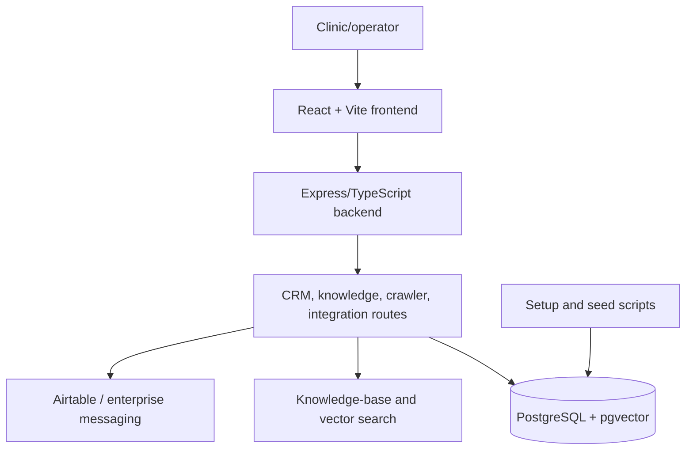

# Medical beauty CRM landing architecture

## Components

| Path | Purpose |
| --- | --- |
| `client/` | CRM and landing-page frontend |
| `server/` | API routes, auth, integration, and data services |
| `drizzle/` | Database schema and migrations |
| `scripts/` | Setup, seed, verification, and integration utilities |
| `.env.example` | Safe configuration template |

## Security notes

Secrets are read from environment variables. Public documentation uses placeholders only; real API keys and Airtable credentials should be rotated if they were ever committed or shared.
