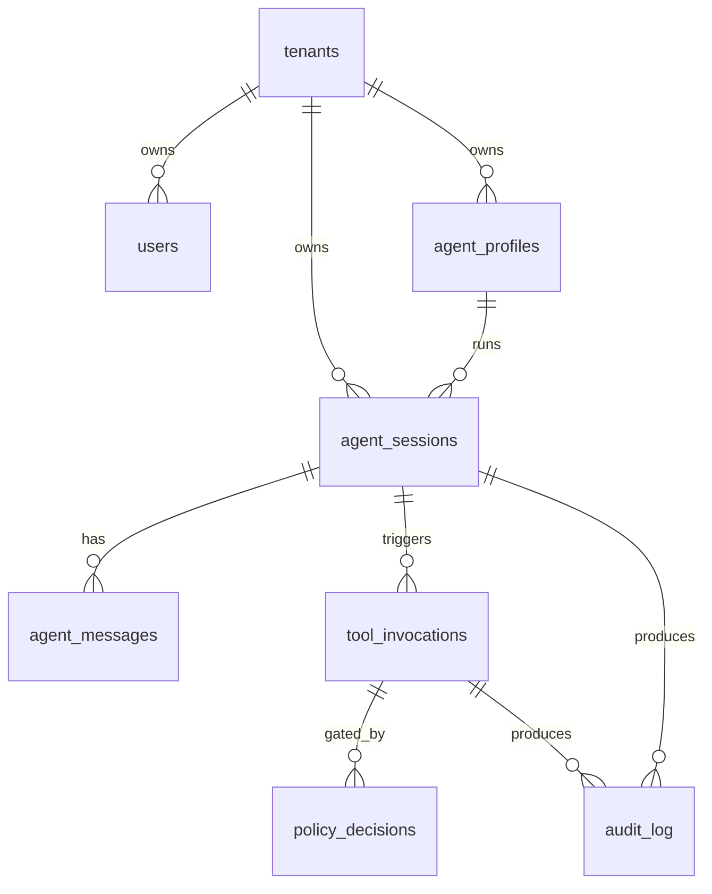

# AI BeautyOS — Database Design (Agent-Native Overlay)

> Status: Draft v1 — proposes a 7-table Agent-Native overlay on top of the existing 37-table CRM schema, plus a tenant_id retrofit plan.
> Owner: backend
> Spec source: this file is the source of truth; implementation lives in `drizzle/schema.ts` + future `drizzle/schema-agent.ts`.
> Related: `docs/architecture/multi-tenant-isolation.md`, `docs/architecture/behavior-policy.md`, `docs/architecture/hermes-adapter.md`.

---

## 1. Principles

1. **Code defines capabilities, config defines behavior, data records facts.**
   The DB stores facts only — never policy logic, never tool code. Policy YAML lives in `config/policies/`; tool YAML in `config/tools/`. DB references them by `policy_id` / `tool_name`, not by content.
2. **Multi-tenant from day one.**
   Every business row gets `tenant_id uuid NOT NULL`. Cross-tenant queries are explicit and audited.
3. **Read-side denormalized, write-side normalized.**
   The CRM tables stay normalized. RAG/embedding tables can denormalize for query speed.
4. **Audit is append-only, never updated.**
   `audit_log` and `tool_invocations` are insert-only; we don't `UPDATE` a fact.
5. **Hermes never writes the schema.**
   Hermes calls Tool Server → Tool Server validates against `config/tools/*.yaml` → Tool Server writes rows. The DB role granted to Hermes adapter is read-only on most tables, write-only on `agent_*`, `tool_invocations`, `audit_log`.

---

## 2. Domain Map

The existing 37 tables fall into 9 domains:

| Domain | Tables |
| --- | --- |
| identity | users |
| crm.lead | customers, leads, conversations, messages, appointments, orders |
| crm.case | cases, case_customers, case_photos, case_treatments, case_authorizations, expert_reviews, service_case_relations |
| catalog | service_categories, service_subcategories, service_details, service_faqs, service_doctor_relations, medical_projects |
| content | knowledge_base, website_content, website_navigation, content_quality_metrics |
| wework | wework_config, wework_contact_way, wework_customers, wework_messages |
| xhs | xiaohongshu_posts, xiaohongshu_content_history, xiaohongshu_comments |
| automation | triggers, trigger_executions |
| learning | user_learning_preferences, user_learning_progress, learning_analytics |
| config | system_config |

This design adds a 10th domain: **agent** (the Agent-Native overlay).

---

## 3. Agent-Native Overlay (7 new tables)



### 3.1 `tenants`
The root of the multi-tenant tree. One row per beauty clinic / brand.

| Column | Type | Notes |
| --- | --- | --- |
| id | uuid pk | gen_random_uuid() |
| slug | varchar(64) unique | url-safe identifier, e.g. `shenzhen-yanmei` |
| display_name | varchar(255) | "深圳妍美" |
| status | varchar(20) | `active` / `suspended` / `archived` |
| plan | varchar(32) | `trial` / `pro` / `enterprise` |
| created_at, updated_at | timestamptz | |
| metadata | jsonb | branding, locale, etc. |

Indexes: `slug` unique, `status`.

### 3.2 `agent_profiles`
A Hermes Behavior Policy materialized as a runnable agent. References `config/policies/hermes/<name>.yaml` by `policy_id` — the YAML is the source of truth, this table is the *binding* (tenant×profile×current_version).

| Column | Type | Notes |
| --- | --- | --- |
| id | uuid pk | |
| tenant_id | uuid fk → tenants(id) | |
| policy_id | varchar(64) | e.g. `sales-assistant`, `content-operator` |
| policy_version | varchar(32) | resolved at bind time, e.g. `2026.05.20` |
| display_name | varchar(255) | |
| enabled | boolean default true | |
| model | varchar(64) | overrides policy default if set, e.g. `deepseek-v4-flash` |
| created_at, updated_at | timestamptz | |
| metadata | jsonb | tenant-specific overrides (greeting, locale, etc.) |

Unique `(tenant_id, policy_id)`. Index on `tenant_id`.

### 3.3 `agent_sessions`
One Hermes conversation. References `agent_profiles` (which policy is acting). The actor (`user_id` or `wework_external_id`) is also recorded.

| Column | Type | Notes |
| --- | --- | --- |
| id | uuid pk | matches `x-request-id` head when feasible |
| tenant_id | uuid fk → tenants(id) | indexed |
| profile_id | uuid fk → agent_profiles(id) | |
| actor_kind | varchar(16) | `user` / `wework_customer` / `xhs_visitor` / `system` |
| actor_ref | varchar(128) | id in the source domain |
| status | varchar(20) | `open` / `closed` / `escalated` |
| started_at | timestamptz default now() | |
| closed_at | timestamptz | |
| last_activity_at | timestamptz | |
| context_snapshot | jsonb | inputs handed to Hermes at start (tenant info, customer summary, etc.) |
| outcome | jsonb | summary, sentiment, conversion |

Composite index `(tenant_id, status, last_activity_at desc)`.

### 3.4 `agent_messages`
Append-only. Every model turn (user, assistant, tool_call, tool_result) gets one row.

| Column | Type | Notes |
| --- | --- | --- |
| id | bigserial pk | |
| session_id | uuid fk → agent_sessions(id) | indexed |
| tenant_id | uuid | denormalized for fast tenant-scoped queries |
| role | varchar(16) | `user` / `assistant` / `system` / `tool` |
| content | text | for `tool` rows this stays NULL, see invocation_id |
| invocation_id | uuid fk → tool_invocations(id) | nullable; set for tool_call + tool_result |
| token_usage | jsonb | `{prompt, completion, total, model}` |
| created_at | timestamptz default now() | |

Index `(session_id, created_at)`, `(tenant_id, created_at desc)`.

### 3.5 `tool_invocations`
Single source of truth for "Hermes (or any agent) tried to call a tool". This replaces the in-memory ring buffer.

| Column | Type | Notes |
| --- | --- | --- |
| id | uuid pk | |
| tenant_id | uuid fk → tenants(id) | indexed |
| session_id | uuid fk → agent_sessions(id) nullable | nullable because some calls come from cron/system |
| caller_kind | varchar(16) | `hermes` / `user` / `cron` / `webhook` |
| caller_ref | varchar(128) | agent profile id or user id |
| tool_name | varchar(64) | matches `config/tools/<name>.yaml` |
| tool_version | varchar(32) | from yaml |
| params | jsonb | request body (PII-redacted via tool schema rules) |
| dry_run | boolean default false | |
| status | varchar(20) | `accepted` / `blocked` / `dry_run` / `ok` / `error` / `rate_limited` / `timeout` |
| latency_ms | integer | |
| result_summary | jsonb | shape defined per tool — no raw rows |
| error_code | varchar(64) | when status in (`blocked`,`error`,`rate_limited`,`timeout`) |
| started_at | timestamptz default now() | |
| finished_at | timestamptz | |
| request_id | varchar(64) | x-request-id from header contract |
| trace_id | varchar(64) | x-trace-id |

Indexes: `(tenant_id, started_at desc)`, `(tool_name, status)`, `(session_id, started_at)`, `(request_id)`.

### 3.6 `policy_decisions`
When a tool call is gated by a Behavior Policy (e.g. "requires_confirm: true" and the confirm flag was not set), we record *why* it was blocked / what was suggested.

| Column | Type | Notes |
| --- | --- | --- |
| id | uuid pk | |
| tenant_id | uuid | indexed |
| invocation_id | uuid fk → tool_invocations(id) | one decision per invocation |
| policy_id | varchar(64) | e.g. `sales-assistant` |
| policy_version | varchar(32) | |
| rule_path | varchar(255) | e.g. `tools.search_customers.access` |
| decision | varchar(20) | `allow` / `deny` / `require_confirm` / `require_dry_run` |
| reason | text | human-readable |
| created_at | timestamptz default now() | |

Index `(tenant_id, decision, created_at desc)`.

### 3.7 `audit_log`
Catch-all append-only audit ring. Persists what `recordAudit()` was logging in-memory.

| Column | Type | Notes |
| --- | --- | --- |
| id | bigserial pk | |
| tenant_id | uuid nullable | nullable for system-level events |
| kind | varchar(64) | e.g. `tool.invoke.ok`, `tool.invoke.blocked`, `policy.eval`, `session.start`, `session.close`, `system.config.change` |
| actor_kind | varchar(16) | `hermes` / `user` / `system` / `cron` |
| actor_ref | varchar(128) | |
| subject_kind | varchar(32) | `tool` / `session` / `customer` / `policy` / `config` |
| subject_ref | varchar(128) | |
| payload | jsonb | shape varies by kind; document each kind in `docs/audit-kinds.md` |
| request_id | varchar(64) | |
| trace_id | varchar(64) | |
| created_at | timestamptz default now() | indexed |

Indexes: `(tenant_id, created_at desc)`, `(kind, created_at desc)`, `(subject_kind, subject_ref)`.

Retention: hot 30 days online; older rows partitioned to monthly tables (`audit_log_y2026m05`...). PG declarative partitioning by `created_at` once volume justifies it (>10M rows).

---

## 4. Tenant Retrofit Plan (37 existing tables)

Every existing business table gets:

```sql
ALTER TABLE <t> ADD COLUMN tenant_id uuid;
UPDATE <t> SET tenant_id = '<DEFAULT_TENANT_UUID>' WHERE tenant_id IS NULL;
ALTER TABLE <t> ALTER COLUMN tenant_id SET NOT NULL;
ALTER TABLE <t> ADD CONSTRAINT <t>_tenant_id_fkey
  FOREIGN KEY (tenant_id) REFERENCES tenants(id) ON DELETE RESTRICT;
CREATE INDEX <t>_tenant_id_idx ON <t> (tenant_id);
```

Plus composite indexes on hot query paths, e.g.
```sql
CREATE INDEX customers_tenant_phone_idx ON customers (tenant_id, phone);
CREATE INDEX conversations_tenant_status_idx ON conversations (tenant_id, status, updated_at desc);
```

The default tenant gets bootstrapped in the migration:
```sql
INSERT INTO tenants (id, slug, display_name, status, plan)
VALUES ('00000000-0000-0000-0000-000000000001', 'default',
        'Default Tenant', 'active', 'enterprise');
```

`system_config` is the only existing table that stays **tenant-optional** (rows with `tenant_id IS NULL` are global). All other 36 require `tenant_id NOT NULL`.

### 4.1 Why not row-level security (RLS)?
PG RLS would be ideal but the current stack uses one DB role (`beautyos`). Phase-1 enforces tenant scoping at the **application** layer (`server/_core/tenant-context.ts`). Adding RLS is a Phase-3 hardening step once we have per-tenant DB roles.

### 4.2 Indexing strategy
- Every FK gets a btree index (drizzle convention).
- Every `tenant_id` gets indexed.
- Composite indexes only for proven hot paths (Dashboard query + tRPC chat lookup).
- `jsonb` columns get GIN indexes only on the `payload`/`metadata` fields that have lookups in production.
- `embedding` columns (knowledge_base) keep their existing pgvector ivfflat index.

---

## 5. Data Lifecycle

| Table | Hot | Warm (read-only) | Cold |
| --- | --- | --- | --- |
| agent_messages | 90 d | 6 mo | export to S3 + drop |
| tool_invocations | 90 d | 12 mo | aggregate to daily rollup |
| audit_log | 30 d | 12 mo | partition-prune |
| policy_decisions | 90 d | 12 mo | keep |
| agent_sessions | open + 30 d after closed | 12 mo | keep |
| business tables | indefinite | — | tenant-controlled export/delete |

---

## 6. Migration Strategy

Order matters:

1. Create `tenants` + seed `default` row.
2. Add `tenant_id` columns to all 36 business tables, default to default tenant, then NOT NULL.
3. Add FK + index on `tenant_id` per table.
4. Create the other 6 agent-native tables (`agent_profiles`, `agent_sessions`, `agent_messages`, `tool_invocations`, `policy_decisions`, `audit_log`).
5. Add composite/hot-path indexes.
6. Done — `pnpm db:push` verifies idempotency.

Implementation will be one migration file (`drizzle/0010_agent_native.sql`) and one schema file (`drizzle/schema-agent.ts` imported by `drizzle/schema.ts`).

---

## 7. Runtime Integration

After the schema lands, the Phase-1 in-memory pieces switch to DB:

- `server/_core/system-registry.ts` — `recordAudit()` writes to `audit_log` (still keeps the 200-entry ring as a hot cache for `/system/audit/recent`).
- `server/_core/tool-server.ts` — every invocation creates a `tool_invocations` row at `accepted`; updates `status` + `latency_ms` + `result_summary` on completion.
- `server/_core/tenant-context.ts` — token-bucket state stays in-process for now; persistence (Redis) deferred.
- Hermes adapter — `chat.createSession` (existing tRPC) starts a row in `agent_sessions`; `sendMessage` appends `agent_messages`.

---

## 8. Open Questions

1. **Per-tenant DB roles** — wait for Phase-3 or do it now?
2. **Vector store** — keep embeddings in `knowledge_base.embedding` or move to a dedicated `agent_knowledge_chunks` table with pgvector? Decision: keep current location, add `tenant_id`.
3. **Redis** — `docker-compose.full.yml` reserves Redis. Used for token-bucket persistence + agent session cache. Decision: ship without Redis in v1; add when needed.
4. **Backfill** — UPDATE 37 tables to set `tenant_id = default` is fine at current data volume (<1M rows). Above that, do batched updates.
